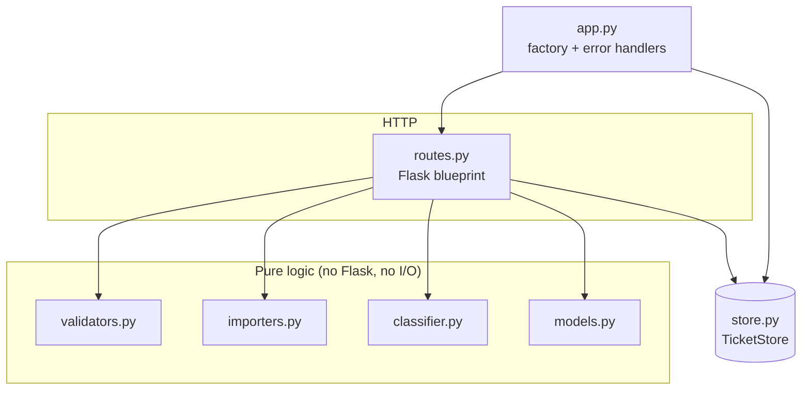
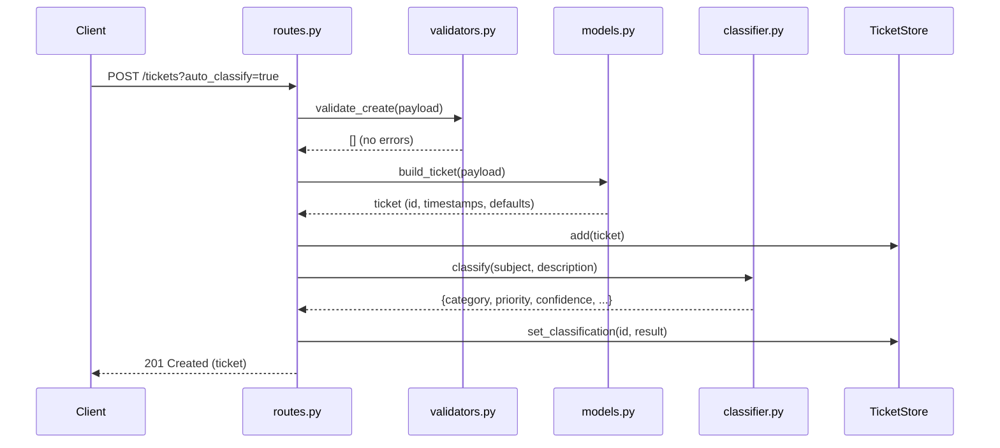
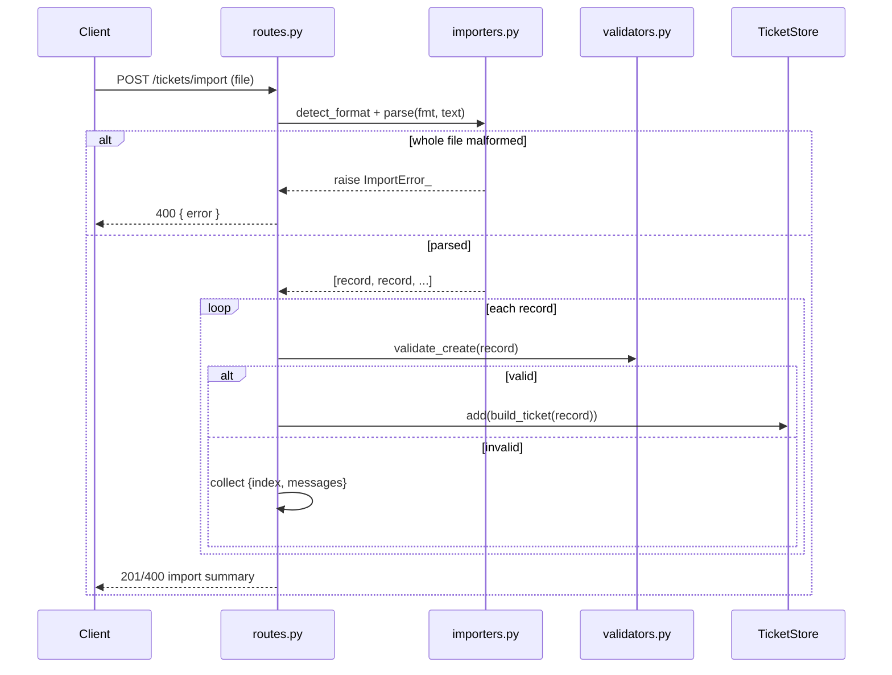

# 🏛️ Architecture

## Overview

A single-process Flask application with **in-memory storage**. The design favours
small, pure modules behind a thin HTTP layer — the same pattern used in Homework 1,
scaled up for multi-format import and auto-classification.

## Components

| Module | Responsibility | Depends on |
|--------|----------------|------------|
| `app.py` | App factory; builds a fresh `TicketStore`, registers the blueprint, installs JSON error handlers | routes, store |
| `routes.py` | The only Flask-aware module: parse request → delegate → shape response | validators, importers, classifier, models, store |
| `validators.py` | Pure field validation; returns `[{field, message}]` | — (stdlib `re`) |
| `models.py` | `build_ticket()` — turn a validated payload into a stored record with ids/timestamps/defaults | — |
| `importers.py` | Parse CSV / JSON / XML text into create-payloads; raise on whole-file errors | — (stdlib `csv`, `json`, `ElementTree`) |
| `classifier.py` | Rule-based category + priority + confidence + reasoning | — |
| `store.py` | Owns all ticket state; add/get/update/delete/filter/classify | — (stdlib `datetime`) |

**Why this split?** Keeping the logic modules free of Flask makes them unit-testable
in isolation (no test client needed) and keeps the routes readable. The store is the
single source of truth for mutable state, so concurrency reasoning is localised.

## Data flow: create + auto-classify

## Data flow: bulk import

## Design decisions & trade-offs

- **In-memory store, no DB.** Matches the assignment scope and keeps setup
  zero-config. Trade-off: state is per-process and lost on restart; not suitable
  for production. A persistence layer would slot in behind the `TicketStore`
  interface without touching routes.
- **Rule-based classification, not an LLM.** Deterministic, offline, free, and
  fully unit-testable. Trade-off: brittle to phrasing (e.g. negations like
  "nothing urgent"); keyword lists are tuned to the spec. An LLM-backed
  classifier could replace `classify()` behind the same signature.
- **Thin routes / pure logic.** Easy to test and reason about; the cost is a
  little indirection between the HTTP layer and the work.
- **Import accepts file upload OR raw body.** Flexible for both browsers and
  curl/scripts; format is inferred from extension or an explicit `?format=`.

## Security & performance considerations

- **Input validation** on every field (lengths, email shape, enum membership)
  guards against malformed data; malformed files fail with a clear message rather
  than a stack trace.
- **Uploads** are read as UTF-8 with replacement; parsing is via stdlib (XML uses
  `ElementTree`). For untrusted input at scale, consider `defusedxml` to harden
  against XML entity-expansion attacks.
- **Performance:** lookups/filters are linear scans over an in-memory list —
  more than fast enough for this scope (see `tests/test_performance.py`, which
  imports 500 tickets in well under 2s). A dict index by id would make `get`
  O(1) if needed.
- **Concurrency:** the store is a simple list; the Flask dev server handles one
  request at a time. The concurrency test exercises 25 simultaneous client
  threads against the test client to confirm correctness under interleaving.
