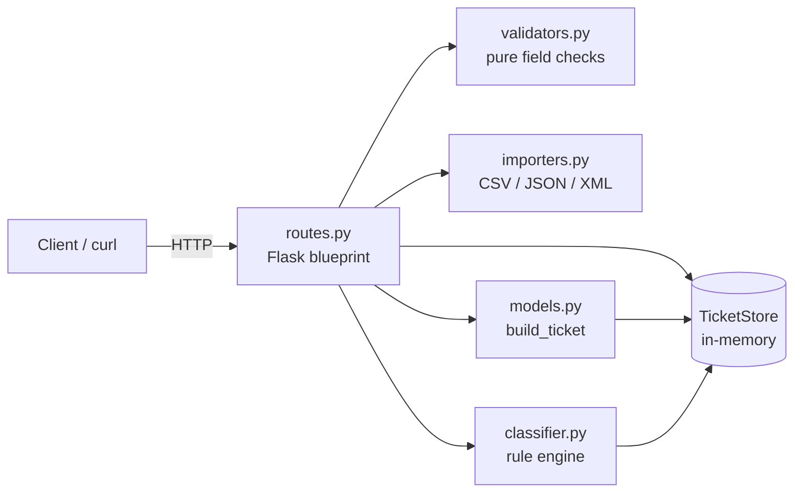

# 🎧 Homework 2: Intelligent Customer Support System

> **Student Name**: Serhii Y.
> **AI Tools Used**: Claude Code (Opus 4.8, Sonnet 4.6, Haiku 4.5)

A REST API for managing customer-support tickets, built with **Python + Flask**
and **in-memory storage** (no database). It imports tickets from **CSV, JSON and
XML**, validates them, and **auto-classifies** each ticket's category and priority
using a deterministic rule engine.

---

## ✨ Features

| Task | Feature | Status |
|------|---------|--------|
| 1 | CRUD endpoints + bulk multi-format import (CSV / JSON / XML) with a per-record summary | ✅ |
| 1 | Field validation (email, string lengths, enums) and graceful malformed-file handling | ✅ |
| 2 | Rule-based auto-classification (category, priority, confidence, reasoning, keywords) | ✅ |
| 2 | Auto-classify on creation/import (`?auto_classify=true`), manual override, decision logging | ✅ |
| 3 | Test suite — **56 tests, 93% coverage** (target was >85%) | ✅ |
| 4 | Multi-level docs (README, API_REFERENCE, ARCHITECTURE, TESTING_GUIDE) + Mermaid diagrams | ✅ |
| 5 | Integration & performance tests (full lifecycle, 25 concurrent requests, benchmarks) | ✅ |

---

## 🏗️ Architecture



The HTTP layer is intentionally thin: it parses the request, delegates to a pure
module, then shapes the JSON response. All mutable state lives in `TicketStore`.

---

## 🚀 Quick start

```bash
cd homework-2
python3 -m venv .venv && source .venv/bin/activate
pip install -r requirements.txt
python -m src.app            # serves on http://localhost:3000
```

> Shortcut: `bash demo/run.sh` does venv + install + start in one step.

See **[HOWTORUN.md](./HOWTORUN.md)** for full setup and example requests.

---

## 🧪 Tests

```bash
python -m pytest -q --cov=src --cov-report=term-missing
```

Expected: **56 passed**, coverage **~93%**. Details in **[TESTING_GUIDE.md](./TESTING_GUIDE.md)**.

---

## 📚 Documentation

| File | Audience | Generated by |
|------|----------|-------------|
| [README.md](./README.md) | Developers (this file) | Claude Opus 4.8 |
| [API_REFERENCE.md](./API_REFERENCE.md) | API consumers — endpoints, schemas, curl | Claude Sonnet 4.6 |
| [ARCHITECTURE.md](./ARCHITECTURE.md) | Technical leads — components, data flow, trade-offs | Claude Opus 4.8 |
| [TESTING_GUIDE.md](./TESTING_GUIDE.md) | QA — test pyramid, fixtures, benchmarks | Claude Sonnet 4.6 |
| [HOWTORUN.md](./HOWTORUN.md) | All — setup, run, test | Claude Haiku 4.5 |

---

## 📁 Project structure

```
homework-2/
├── src/
│   ├── app.py          # Flask app factory + JSON error handlers
│   ├── routes.py       # 7 endpoints (thin HTTP layer)
│   ├── models.py       # build_ticket() — payload -> stored record
│   ├── validators.py   # enums, email, length checks (pure)
│   ├── store.py        # TicketStore — in-memory state + filtering
│   ├── importers.py    # CSV / JSON / XML parsers
│   └── classifier.py   # rule-based category + priority engine
├── tests/              # 9 test modules + fixtures (56 tests)
├── demo/               # run.sh, sample_tickets.{csv,json,xml}, requests
└── docs/screenshots/   # test coverage screenshot
```

---

## 🤖 How AI was used

- **Claude Opus 4.8** scaffolded all source modules following the structure
  established in Homework 1 (app factory, injected in-memory store, pure validators,
  thin routes). It also generated the test suite, sample data, and caught a
  classifier edge case via a failing test ("nothing urgent" wrongly matching the
  `high` priority tier — fixed by aligning keywords to the spec).
- **Claude Sonnet 4.6** regenerated `API_REFERENCE.md` and `TESTING_GUIDE.md`,
  demonstrating a lighter model's suitability for structured reference documentation.
- **Claude Haiku 4.5** regenerated `HOWTORUN.md`, showing the fastest model handles
  procedural setup guides well.
- All code was reviewed and verified by running the full suite and smoke-testing
  the live API. See `docs/screenshots/` for evidence.

<div align="center">

*This project was completed as part of the AI-Assisted Development course.*

</div>
