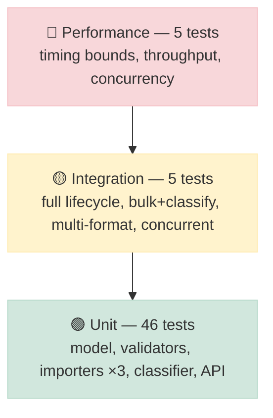

# 🧪 Testing Guide

## Test pyramid



The majority of tests are **unit tests** that exercise pure modules (no Flask
test client required) — fast, isolated, and easy to debug. Integration and
performance tests sit above, covering cross-cutting behaviour.

---

## Setup

```bash
cd homework-2
python3 -m venv .venv
source .venv/bin/activate          # Windows: .venv\Scripts\activate
pip install -r requirements.txt
```

---

## Running the tests

```bash
# All tests, quiet output
python -m pytest -q

# With coverage report
python -m pytest -q --cov=src --cov-report=term-missing

# HTML coverage report (open in browser)
python -m pytest --cov=src --cov-report=html && open htmlcov/index.html

# Single test module, verbose
python -m pytest tests/test_categorization.py -v

# Single test by name
python -m pytest -k "test_full_ticket_lifecycle" -v
```

**Expected result:** `56 passed`, total coverage **~93%** (requirement: >85%).

---

## Test modules

### Unit tests

| Module | Tests | What it covers |
|--------|-------|----------------|
| `test_ticket_model.py` | 9 | `build_ticket` defaults/ids, `validate_create` required fields, email, length, enum, metadata, `validate_update` |
| `test_ticket_api.py` | 11 | All 7 endpoints — happy paths, 400/404 error cases, delete-then-get, status filter |
| `test_import_csv.py` | 6 | CSV parse, metadata/tag nesting, blank row skip, empty file, upload endpoint, per-record failure summary |
| `test_import_json.py` | 5 | Array format, `{tickets:[]}` wrapper, malformed JSON, non-array, raw-body import endpoint |
| `test_import_xml.py` | 5 | XML parse, metadata/tags, malformed XML, no `<ticket>` elements, upload endpoint |
| `test_categorization.py` | 10 | Each category, `other`/low-confidence, urgent/high/low/medium priority, auto-classify endpoint + stored result |

### Integration tests

| Test | What it verifies |
|------|-----------------|
| `test_full_ticket_lifecycle` | Create → in_progress → resolved (resolved_at stamped) → delete → 404 |
| `test_bulk_import_with_auto_classification` | CSV upload with `auto_classify=true` → all tickets carry a valid classification |
| `test_combined_category_and_priority_filter` | Two tickets, same category different priority → filter returns exactly one |
| `test_concurrent_ticket_creation` | 25 threads each create a ticket → all 201, store holds exactly 25 |
| `test_multi_format_import_accumulates` | CSV + JSON + XML imports in sequence → 7 total tickets (3+2+2) |

### Performance tests

| Test | Bound | What it measures |
|------|-------|-----------------|
| `test_bulk_import_500_under_2s` | < 2.0 s | CSV parse + validate + store for 500 records |
| `test_classify_throughput` | < 1.0 s | 1 000 classifier calls |
| `test_list_after_many_inserts_is_fast` | < 0.5 s | GET /tickets after 200 inserts |
| `test_filter_scales` | < 0.5 s | GET /tickets?status=new over 200 records |
| `test_get_by_id_lookup_fast` | < 0.2 s | GET /tickets/:id among 200 records |

Bounds are generous — they guard against accidental O(n²) regressions, not exact
timing. Typical runtimes are 10–50× under the limit.

---

## Test fixtures

Located in `tests/fixtures/`:

| File | Records | Purpose |
|------|---------|---------|
| `valid_tickets.csv` | 3 | Happy-path CSV parsing with metadata and tags |
| `valid_tickets.json` | 2 | Happy-path JSON parsing |
| `valid_tickets.xml` | 2 | Happy-path XML parsing with nested `<metadata>` and `<tags>` |
| `invalid_tickets.csv` | 3 | Every row fails validation (bad email, missing id, bad enum) |
| `malformed.json` | — | Truncated JSON — triggers whole-file parse error |
| `malformed.xml` | — | Unclosed tag — triggers whole-file parse error |

Larger demo data for manual testing lives in `demo/`:

| File | Records | Notes |
|------|---------|-------|
| `sample_tickets.csv` | 50 | Deterministic (seeded random); all valid |
| `sample_tickets.json` | 20 | Subset of the same seed |
| `sample_tickets.xml` | 30 | Subset of the same seed |
| `invalid_tickets.csv` | 5 | Mixed valid/invalid rows; good for import-summary testing |

Regenerate demo data: `python demo/generate_samples.py`

---

## Manual testing checklist

### Core CRUD

- [ ] `POST /tickets` with all required fields → `201` with a UUID `id`
- [ ] `POST /tickets` missing `customer_email` → `400` with `details[].field = customer_email`
- [ ] `POST /tickets` with `customer_email: "bad"` → `400` invalid email message
- [ ] `POST /tickets` with `subject` over 200 chars → `400` length message
- [ ] `GET /tickets` → array (empty on fresh start)
- [ ] `GET /tickets/:id` with a real id → `200` ticket
- [ ] `GET /tickets/:id` with a fake id → `404`
- [ ] `PUT /tickets/:id` `{ "status": "resolved" }` → `200`, `resolved_at` is not null
- [ ] `DELETE /tickets/:id` → `204`, then `GET` the same id → `404`

### Filtering

- [ ] `GET /tickets?category=billing_question` → only billing tickets
- [ ] `GET /tickets?priority=urgent&status=new` → intersection of both filters
- [ ] `GET /tickets?assigned_to=agent-1` → only that agent's tickets

### Auto-classification

- [ ] `POST /tickets?auto_classify=true` → response ticket has `classification` not null
- [ ] `POST /tickets/:id/auto-classify` → `200` with `category`, `priority`, `confidence`, `keywords`
- [ ] After classify, `GET /tickets/:id` → `category` and `priority` updated on the ticket

### Bulk import

- [ ] `curl -F file=@demo/sample_tickets.csv .../tickets/import` → `201`, `successful: 50`, `failed: 0`
- [ ] `curl -F file=@demo/invalid_tickets.csv .../tickets/import` → `400`, `failed > 0`, `errors[].messages` populated
- [ ] `curl -F file=@tests/fixtures/malformed.json?format=json .../tickets/import` → `400` parse error
- [ ] JSON import via raw body: `curl -X POST "?format=json" --data-binary @sample_tickets.json` → `201`
- [ ] XML upload with `?auto_classify=true` → all imported tickets have `classification`

### Edge cases

- [ ] `POST /tickets` with no body → `400` "Invalid or missing JSON body"
- [ ] `PUT /tickets/:id` with empty body `{}` → `400` "at least one field"
- [ ] `POST /tickets/import` with no data → `400` "No import data provided"
- [ ] Unknown route `GET /bananas` → `404`

---

## Coverage notes

Uncovered lines (7% of 402 statements) are:

- `app.py:19,23,27,37` — the 404/405/500 Flask error handlers (only fire on framework-level
  errors; the test client's routing bypasses them in most scenarios).
- `routes.py:48,66,71-72,120,124,139` — a few `None`-guard branches and the
  `ImportError_` re-raise path that requires constructing a broken file in a
  specific way the current fixtures don't hit.
- `importers.py`, `store.py`, `validators.py` — similar defensive branches.

These are all legitimate defensive paths; achieving 100% would require error-injection
that adds test complexity without meaningful safety benefit.
