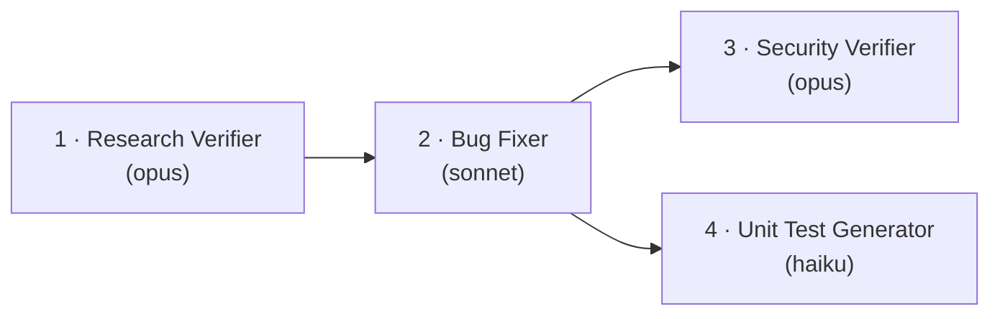
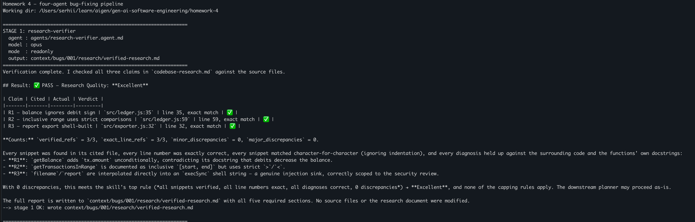
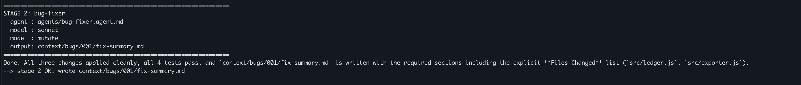
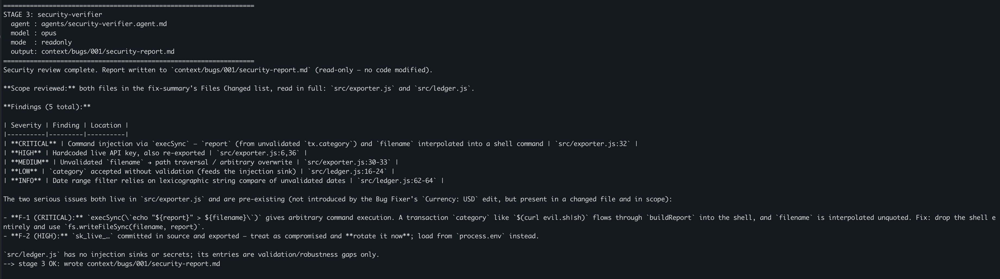
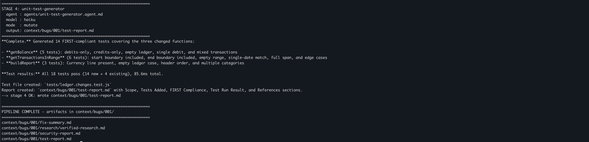

# Homework 4 — Four-Agent Bug-Fixing Pipeline

**Author:** Serhii Yefanov

A self-contained, one-command **agentic pipeline** that researches, fixes, security-reviews
and tests bugs in a small sample application. Four agents run in order via headless
`claude -p`, each with an **explicitly chosen model** and each loading its own **skill**.



Run order: **Research Verifier → Bug Fixer → Security Verifier → Unit Test Generator.**

---

## The sample application

`src/` holds a tiny Node.js transaction-ledger module (zero runtime dependencies, tested
with the built-in `node:test` runner). It ships with **seeded defects** so the pipeline has
real work to do (documented in [`context/bugs/001/bug-context.md`](context/bugs/001/bug-context.md)):

| # | Type | Where | Defect |
|---|------|-------|--------|
| 1 | Logic bug | `src/ledger.js` · `getBalance` | Debits were **added** instead of subtracted → inflated balance (1550 vs. correct 1050). |
| 2 | Logic bug | `src/ledger.js` · `getTransactionsInRange` | Strict `>`/`<` excluded boundary dates on an inclusive range (off-by-one). |
| 3 | Security (CRITICAL) | `src/exporter.js` · `exportReport` | Command injection — untrusted filename + report data interpolated into `execSync`. |
| 4 | Security (HIGH) | `src/exporter.js` | Hardcoded live-format secret (`sk_live_…`) committed to source. |

The Bug Fixer fixes the two **logic bugs** (and makes a small touch to `exporter.js`); the
two **security issues** are left in place by design so the Security Verifier — which is
report-only — has genuine findings to report on the changed code.

---

## The agents and why each model

Each agent is a Markdown file in [`agents/`](agents/) with YAML frontmatter declaring its
`model`, `allowed-tools`, and the `skill` it loads. The pipeline reads the model from the
frontmatter (frontmatter is the single source of truth) and selects it per stage.

| Stage | Agent | Model | Why this model |
|-------|-------|-------|----------------|
| 1 | [`research-verifier`](agents/research-verifier.agent.md) | **opus** | Fact-checking every `file:line` and snippet, then grading quality, is accuracy-critical reasoning — worth the strongest model. |
| 2 | [`bug-fixer`](agents/bug-fixer.agent.md) | **sonnet** | Applying a fully specified before/after plan and running tests is routine, well-scoped work — a balanced model is the right cost/quality trade-off. |
| 3 | [`security-verifier`](agents/security-verifier.agent.md) | **opus** | Security judgment (exploitability, severity, threat reasoning) is where mistakes are most costly — strongest model. |
| 4 | [`unit-test-generator`](agents/unit-test-generator.agent.md) | **haiku** | Mechanically scaffolding tests for already-known changed functions is fast, cheap work — the fastest model keeps the pipeline quick and inexpensive. |

### Skills

Two skills (in [`skills/`](skills/)) are **auto-loaded** by the pipeline into the relevant
agent's system prompt:

- [`research-quality-measurement.md`](skills/research-quality-measurement.md) — defines the
  quality levels (**Excellent / Good / Adequate / Poor / Unreliable**) and the objective
  counts/rules the Research Verifier must use, plus the required output sections.
- [`unit-tests-FIRST.md`](skills/unit-tests-FIRST.md) — defines **F**ast, **I**ndependent,
  **R**epeatable, **S**elf-validating, **T**imely with a concrete checklist and `node:test`
  examples that the Unit Test Generator must follow.

---

## How to run

```bash
cd homework-4
npm test          # BEFORE: 2 of 4 baseline tests fail (the seeded logic bugs)
npm run pipeline  # runs all 4 agents headlessly, in order, each with its model
npm test          # AFTER: all tests pass, including the 9 generated tests
npm start         # demo: prints the corrected ledger (Net balance: 1050)
```

`npm run pipeline` simply runs [`run-pipeline.sh`](run-pipeline.sh). See
[`HOWTORUN.md`](HOWTORUN.md) for prerequisites, the permission model, and how to re-run.

---

## What a real run produced

All four artifacts below were generated by an actual pipeline run (not hand-written):

| Stage | Output | Result |
|-------|--------|--------|
| 1 | [`research/verified-research.md`](context/bugs/001/research/verified-research.md) | **PASS — Research Quality: Excellent** (3/3 refs verified, 0 discrepancies). |
| 2 | [`fix-summary.md`](context/bugs/001/fix-summary.md) | All 3 changes applied cleanly; **4/4 tests pass**. |
| 3 | [`security-report.md`](context/bugs/001/security-report.md) | **1 CRITICAL** (command injection) + **1 HIGH** (hardcoded secret) + MEDIUM/LOW/INFO, each with `file:line` + remediation. |
| 4 | [`test-report.md`](context/bugs/001/test-report.md) + [`tests/ledger.changes.test.js`](tests/ledger.changes.test.js) | 14 FIRST-compliant tests generated; **18/18 tests pass**. |

> The Security Verifier is report-only, so the two security issues remain in the code by
> design — remediating them would be a follow-up fix cycle (the report lists exact fixes).

### Screenshots

**Stage 1 — Pipeline run**



**Stage 2 — Applied fix**



**Stage 3 — Security report**



**Stage 4 — Tests passing**



---

## Project structure

```
homework-4/
├── README.md                 # this file
├── HOWTORUN.md               # step-by-step run guide
├── package.json              # scripts: test, start, pipeline
├── run-pipeline.sh           # one-command orchestrator (resumable, retries transient errors)
├── agents/                   # 4 *.agent.md definitions (model + tools + skill in frontmatter)
├── skills/                   # research-quality-measurement.md, unit-tests-FIRST.md
├── src/                      # ledger.js, exporter.js, cli.js (the app under test)
├── tests/                    # ledger.test.js (baseline) + ledger.changes.test.js (generated)
├── context/bugs/001/         # bug-context, research/, implementation-plan, and the 4 artifacts
└── docs/screenshots/         # pipeline run, fixes, security scan, test results
```

---

## AI tools used

- **Claude Code** for the whole build (planning, scaffolding, agent/skill authoring).
- **The pipeline itself is the deliverable:** four headless **Claude** agents
  (opus / sonnet / opus / haiku) orchestrated by `run-pipeline.sh`, each loading its skill,
  producing the verified-research, fix-summary, security-report and test-report artifacts.
- **Verified by hand:** ran `npm test` before/after (2 failing → 13 passing), read every
  generated artifact, and confirmed the applied source diff matches the implementation plan.
